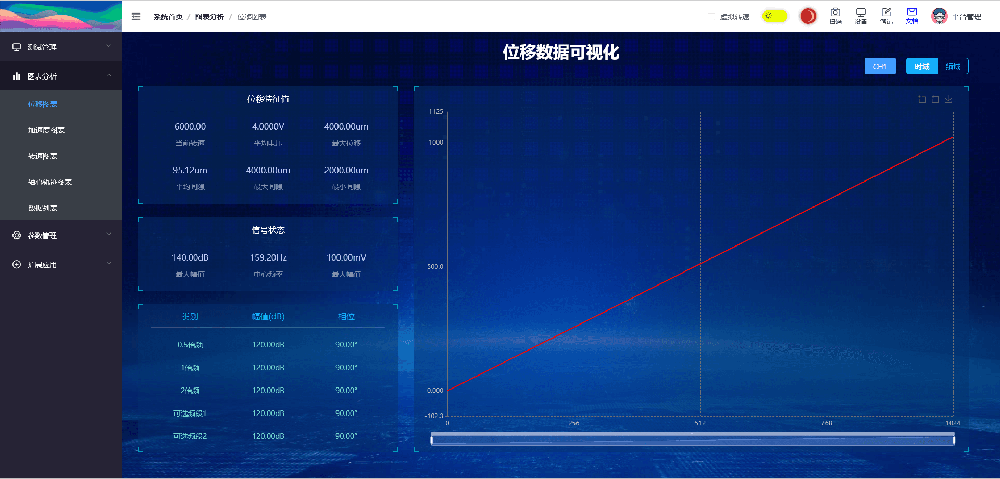
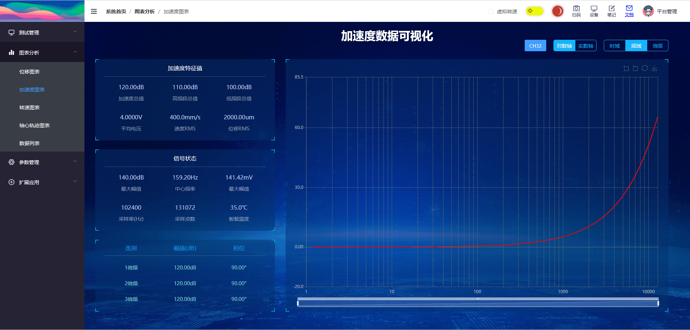
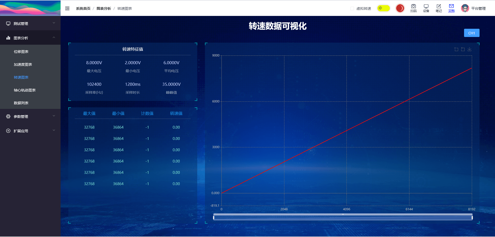
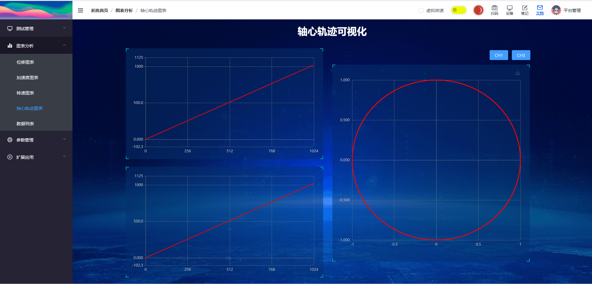
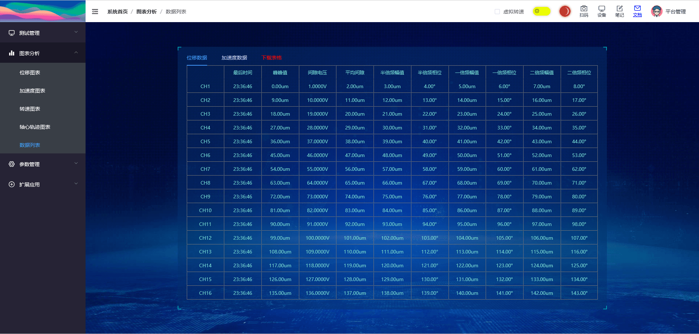

::: info
图表分析使用了数据大屏的UI风格，你可以通过 [侧边抽屉的外观选项功能页](./sidemenu.md#外观) 进行关闭。

当前图表类型：位移时域/频域、加速度时域/频域、1/3倍频程、转速时域、轴心轨迹。

后续可能会按照实际情况，添加新的分析图表与功能。
:::

## 位移图表

> 路由路径: /chart/disdataview

左侧显示特征值，右侧显示图表，提供时域/频域切换。

## 加速度图表

> 路由路径: /chart/accdataview

左侧特征值，右侧图表，提供对数轴/实数轴切换 **(频域有效)**，提供时域/频域/倍频程切换。

## 转速图表

> 路由路径: /chart/rpmdataview

左侧特征值，右侧图表，转速ADC实际时域图，辅助现场转速传感器的调试安装。

## 轴心轨迹

> 路由路径: /chart/axisdataview

## 数据列表

> 路由路径: /chart/listdataview

位移/加速度数据列表显示，提供csv格式数据下载方式。

