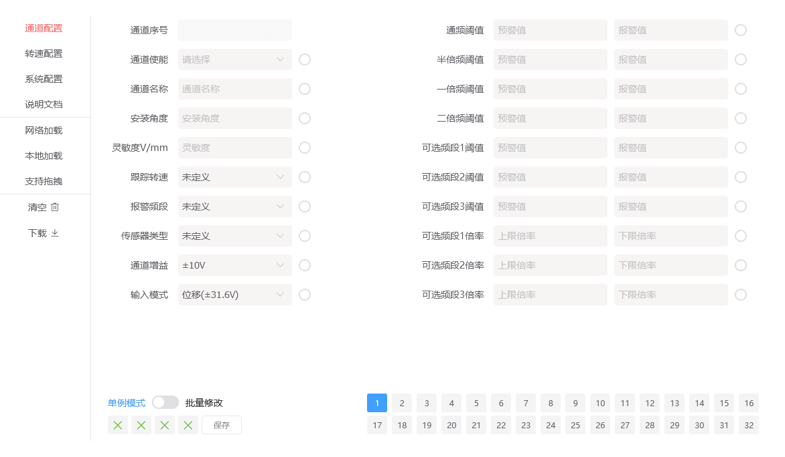
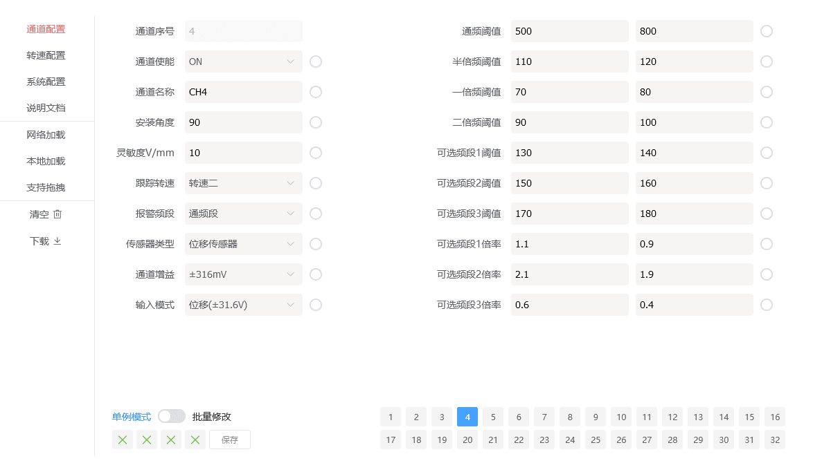
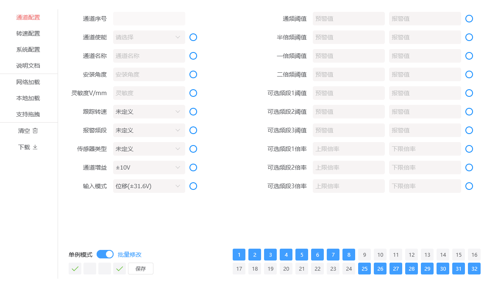

```js
const obj = (()=>()=>({})||[])()()  /* JavaScript混淆 */
```

## 配置参数

> 路由路径: /test/tabpanel

config.json的可视化配置UI。支持单独修改与批量修改两种方式。

配置文件的加载，支持服务器加载与本地文件加载两种方式。修改配置时，不影响源文件数据。**需用户自行下载修改后的配置文件**。

更新配置文件的方式：

1. 下载修改后的配置文件，通过右键菜单的 [文件上传功能](./contextmenu.md#文件上传) 更新至服务端。
2. 使用参数热更新页面。



开关指向单例模式时，点击页码，可单独修改该页码的通道配置。



开关指向批量修改时，点击页码，可加入批量修改的通道组。同时在模式开关下方提供了4个通道组辅助按钮，帮助用户快速选中/取消通道。

**批量修改后，需点击保存**，才能将修改项同步到通道组内的通道。


