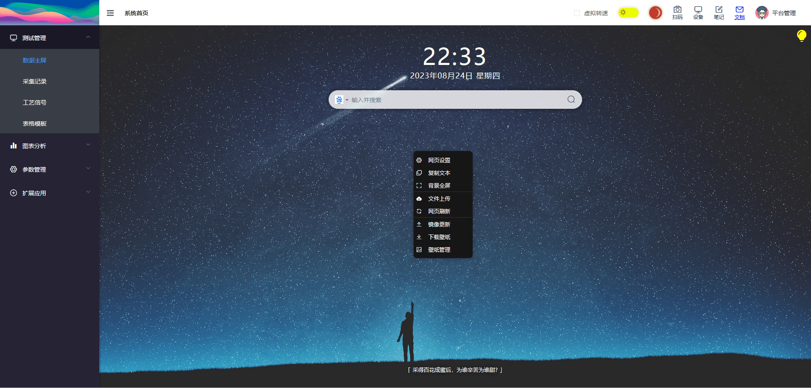
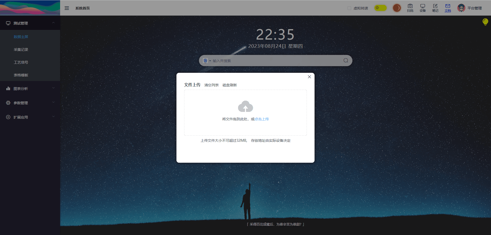
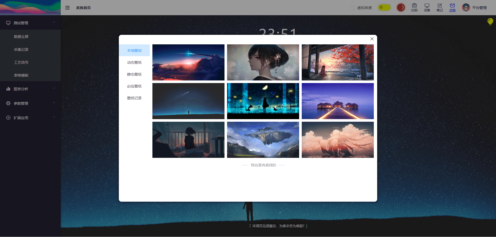
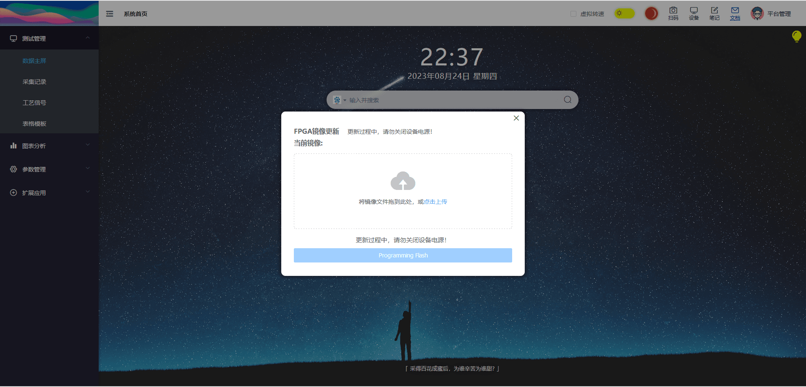

## 菜单选项

::: info 对话框其他入口说明
1. 壁纸管理 对应了[侧边抽屉外观选项](./sidemenu.md#外观)
2. 添加笔记 对应了[开屏页右上角我的笔记](./dashboard.md#我的笔记)
3. 文件上传 对应了[侧边抽屉功能选项](./sidemenu.md#功能)
:::

## 背景全屏

背景全屏效果图如下。

## 文件上传

> 组件名称：upload

使用该功能时，上传文件放置在指定文件夹下。**请注意同名文件覆盖问题。**

::: tip 文件存放位置
1. ZD4412: **/media/disk/Update**
2. RK3399: **/home/linaro/update**
3. FT2000: **/home/dhl/UpDate**
:::

## 壁纸管理

> 组件名称：wallpaper

提供背景壁纸切换与下载。

## 镜像更新

> 组件名称：flashutils

FPGA multiboot 双镜像在线更新方案。精力有限，目前不打算做其他平台的实现。
因此，该功能 **仅支持小范围的生产设备(携带Web服务)。**

