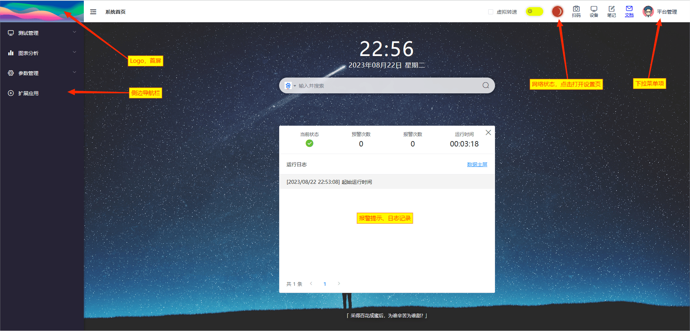
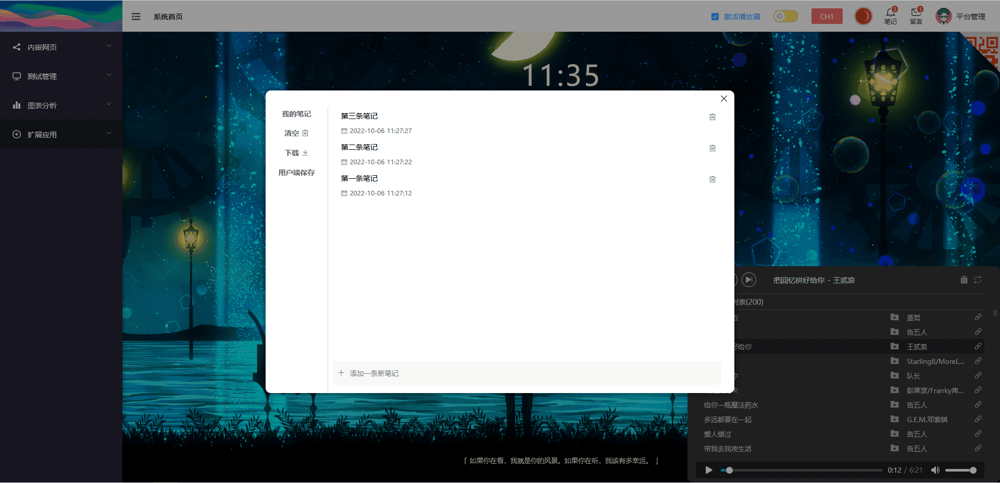
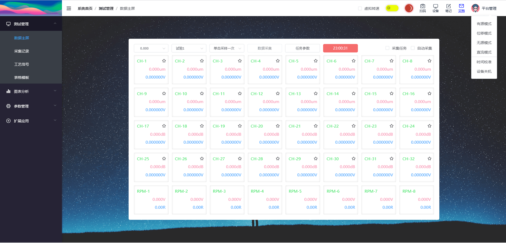
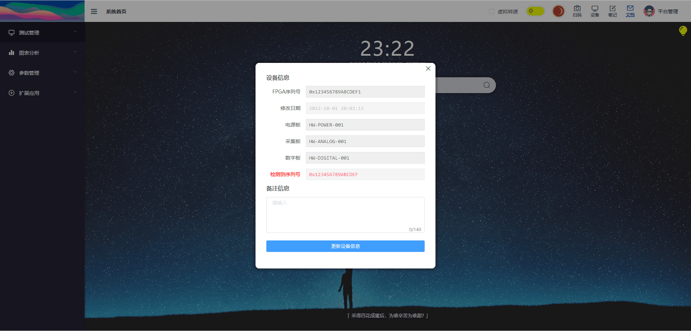
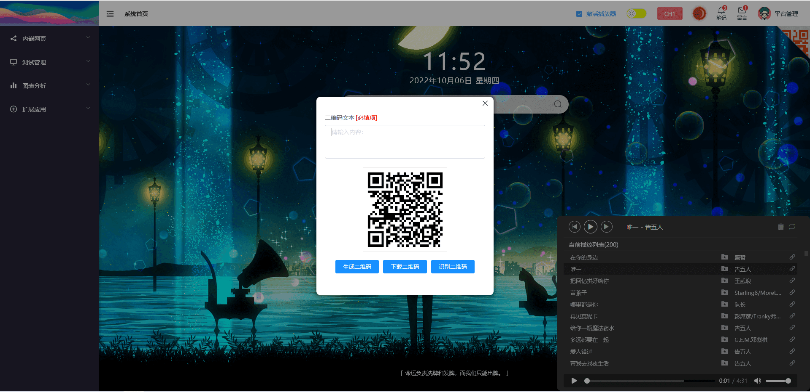

``` js
"hello world".split('').forEach(e => console.log(e)) 
```

## 开屏页

> 路由路径: /dashboard

**注: 文档内的图片可点击放大**



## 页面标注

::: info 标注说明
01. logo图片 点击**回到系统首页**
02. 面包屑导航
03. 侧边栏，路由导航
06. websocket 状态灯。点击状态灯可打开 [侧边抽屉](./sidemenu.md)
07. 笔记对话框 [查看详情](./dashboard.md#我的笔记)
09. 全局下拉菜单 [查看详情](./dashboard.md#下拉菜单)
08. 设备对话框 [查看详情](./dashboard.md#我的留言)
10. 二维码识别生成插件 [查看详情](./dashboard.md#二维码)
12. 搜索栏，点击左边图标可切换**搜索引擎**
13. 每日一言
:::

## 我的笔记

笔记数据仅保存在**浏览器端**，若需要在设备端保留设备信息，请打开[设备对话框](./dashboard.md#设备信息)。



## 下拉菜单

截止至文档编写日期为止，目前共有6个下拉选项。

::: info 设备指令
1. 有源模式 兼容旧设备的运行模式指令
2. 位移模式 兼容旧设备的调试模式指令
3. 无源模式 新增功能，加速度无电流源模式
4. 直流模式 新增功能，加速度直流模式
5. 时间校准 新增功能，网页发送当前时间 +10ms(预估网络延时) 至设备端同步时间
6. 设备关机 新增功能，设备端进入关机流程
:::



## 设备信息

设备信息更新后，将保存在服务器路径 **/conf/device.json** 文件中。websocket连接后，服务器将发送一段全局静态变量，其中包含FPGA的序列号。

用户端将序列号与设备信息保存的序列号进行对比。



## 二维码

二维码功能暂时没有特殊的联动功能，目前仅作为小工具使用，**支持拖拽识别**。


