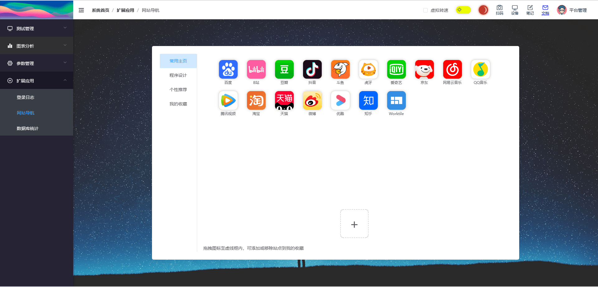
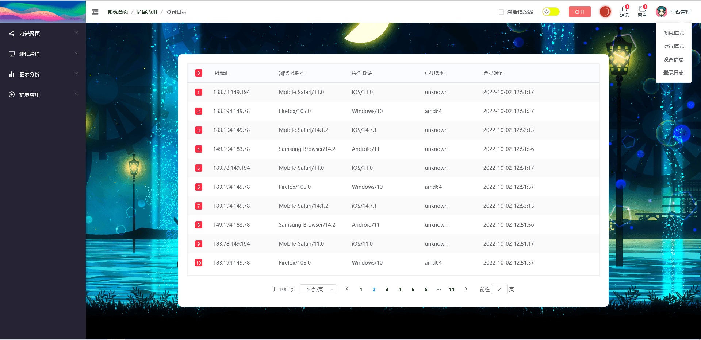
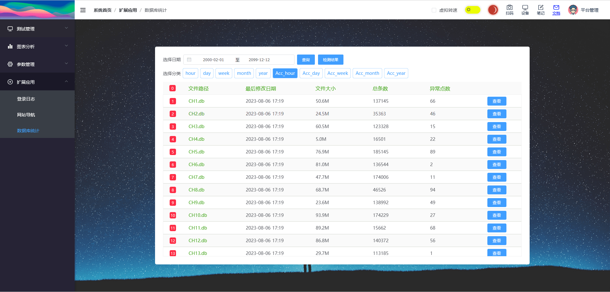

::: info
非通用、非常驻功能。 扩展应用仅作为作者私货，不影响实际采集测试。
:::

## 网站导航

> 路由路径: /extend/homepage

网站导航因缺少站点的icon图标，暂不支持扩展其他站点信息。

## 登录日志

> 路由路径: /extend/loginlog

登录日志以txt形式保存在服务器路径 **/conf/login.log** 文件中。

改版后，日志组件已移至左侧导航组件中。

## 数据库统计

> 路由路径: /extend/database

该功能为实验功能，仅限于小范围使用(Web环境)。
描述说明请参考 [merry-monitor](https://merrymerrys.github.io/merry-monitor/guide/database.html)

