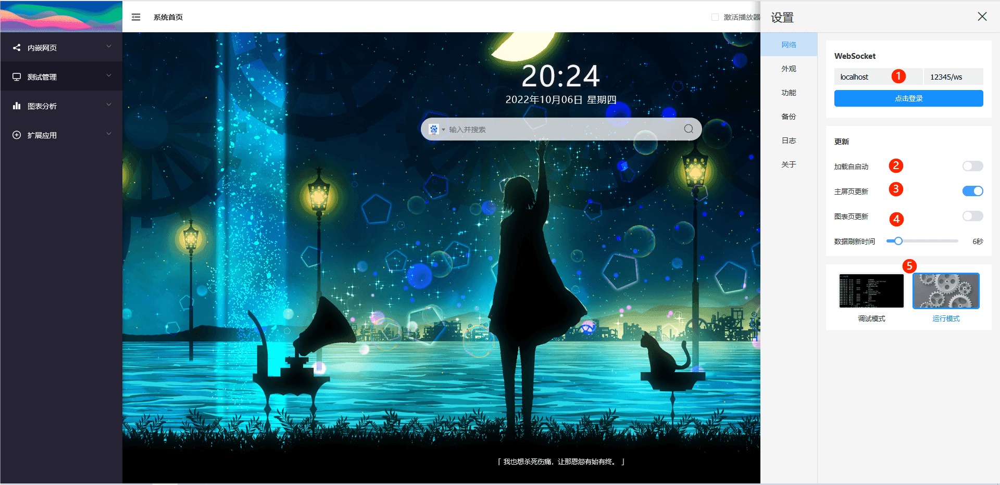
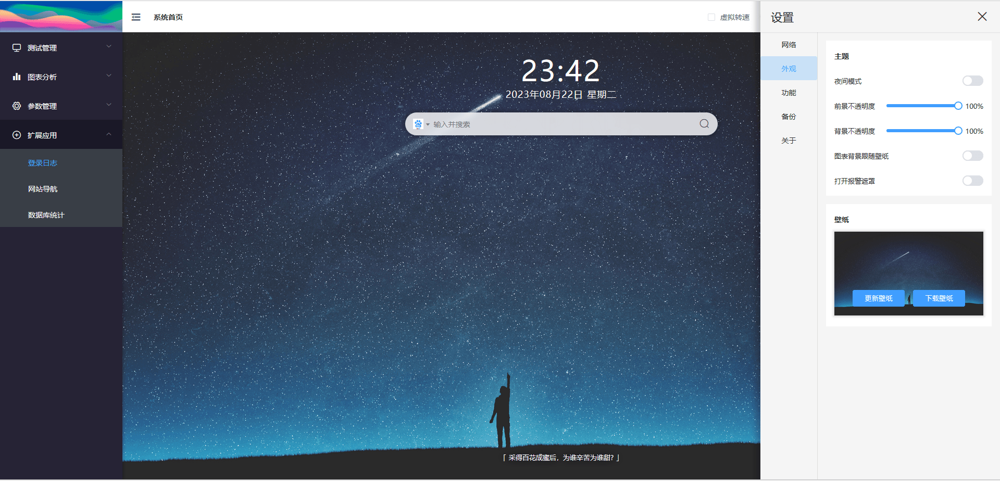
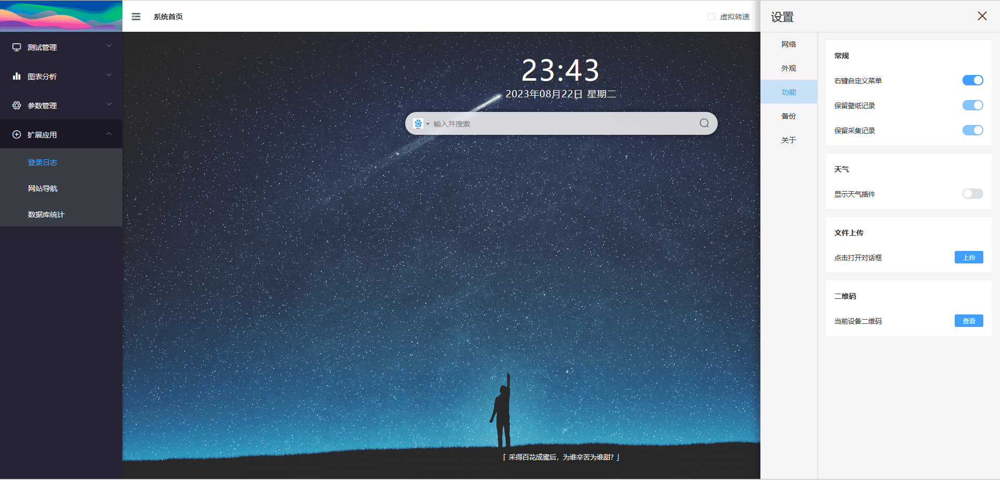

::: info 侧边抽屉的打开方式
1. 点击状态灯 -> [ 开屏页](./dashboard.md#默认开屏页)
2. 右键菜单 -> 网页设置
:::

## 网络

> 组件名称: websocket

::: info 标注说明
01. WebSocket的登录地址与端口路径。
02. **首屏渲染结束后**，是否尝试自动连接WebSocket服务器。
03. 主屏页更新，[数据主屏](./test.md#数据主屏) 数据更新使能。
04. 图像页更新，[图表分析](./chart.md) 数据更新使能。
05. **在WebSocket已连接的条件下**，点击可切换至相应的模式。
:::

## 外观

> 组件名称: skin

::: info 选项说明
01. 日间|夜间模式切换。
02. 前景不透明度，表现为数据主屏的透明度。
03. 背景不透明度，表现为壁纸的透明度。
04. 关闭图表数据大屏的UI风格，使用壁纸作为背景图。
05. 数据主屏中的通道报警遮罩功能开关。
:::

## 功能

> 组件名称: tool

::: info 选项说明
01. 打开/关闭右键自定义菜单功能。
02. 保留背景壁纸切换时的历史记录功能。
03.  [数据主屏](./test.md) 采集数据的持久化，**可解决网页刷新后，缓存数据丢失的问题**。
04. 天气插件由 [和风天气](https://www.qweather.com/) 提供。
05. [文件上传对话框](./contextmenu.md#文件上传)。
:::

