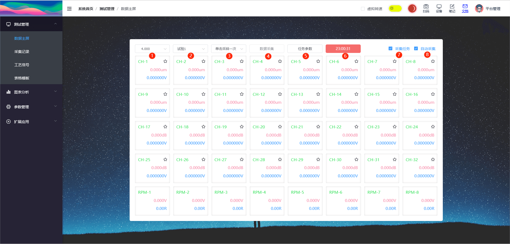
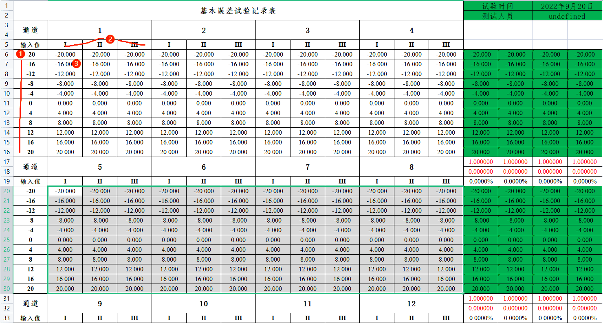
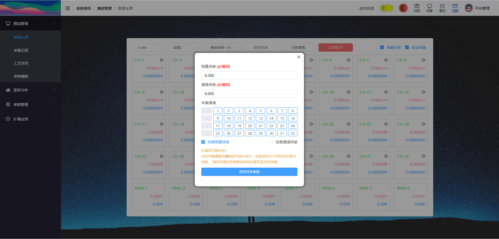
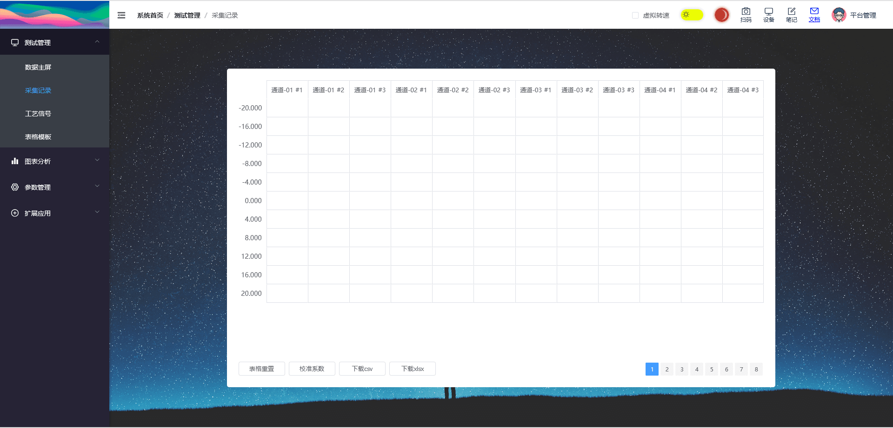
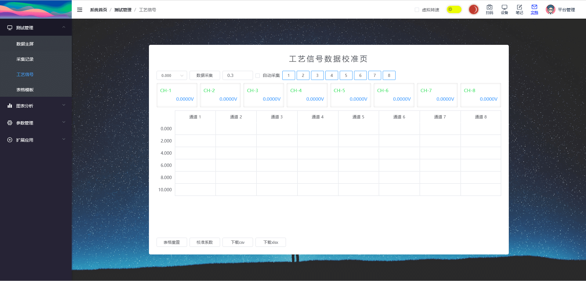
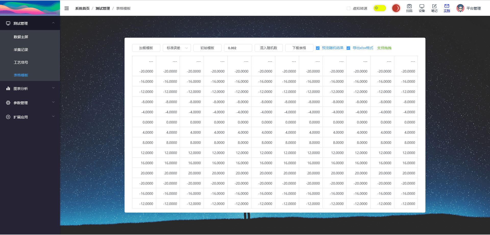

``` js
const dp = new Array(n).fill(0).map(() => new Array(n).fill(0))
```

## 数据主屏

> 路由路径: /test/monitor

数据主屏一方面用于观察数据状态。
另一方面也是测试功能的入口，基本误差的自动测试说明，如下图所示。



::: info 标注说明
01. 数据测试中的标准参考值。对应 **excel表的标注1**。
02. 数据测试中的试验次数，每个通道有三组试验。对应 **excel图中标注2**。
03. 单击数据采集时，触发采集的次数。(连点器效果)
04. 数据采集按钮，**采集标有星号的通道数据**，采集数据存放在 [采集记录](./test.md#采集记录)。
05. 任务参数，可配置需要的采集通道等相关配置。[查看详情](./test.md#任务参数)
06. 当前采集数据状态，默认为平均值。
07. 采集任务使能，控制采集程序激活。
08. 自动采集使能，控制采集程序激活。
:::



## 任务参数

::: info
**测量误差 与 检查测量误差**

  当使能检查测量误差后，WebSocket接收到服务器数据时将启动自动采集的测量。

  例如：外部电压为+4V时，若带标记的采集通道与+4V之间的误差全部小于设定值0.300，则程序将识别出标准参考值为4V，并将数据主屏中的 **标注1** 改为4.000。

**通道误差 与 检查通道误差**

  当使能通道测量误差后，当前标准参考值 **改变后** 将启动通道误差的检查。
  经过实测，该功能实用性不高。**一般情况不建议使用**

**采集通道**
  被选中的采集通道，将作为自动测试的有效通道。并在主屏上 **标注星星图标** 用于区别。
:::

**自动采集与任务参数强相关**



## 采集记录

> 路由路径: /test/record

采集后的缓存数据。提供数据重置、数据校准功能；csv、xlsx两种格式的excel下载。



## 工艺信号

> 路由路径: /test/slowdata

新增任务类型，同时提供信号的展示、采集与缓存；与数据重置、数据校准、excel下载等功能。



## 表格模板

> 路由路径: /test/excel

excel模板，提供4种内置模板。可实现随机数的混入与批量下载。



